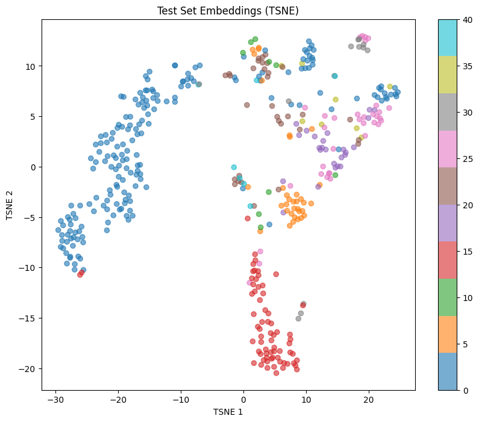

# SimCLR for Fast Learning
By Prakhar Sinha

## Introduction
*SimCLR for Fast Learning* is a fine-tuned version of the original [*PyTorch SimCLR: A Simple Framework for Contrastive Learning of Visual Representations*](https://github.com/sthalles/SimCLR) model trained on the firefighting device detection dataset on [Roboflow](firefighting-device-detection/). 

## Evaluation
<p align="middle">
  
   
</p>

The final accuracy of the model on the test dataset was $\approx 0.8$. TSNE analysis was used to visualize the embedding space.

## Hardware/Enviornment
This model was trained on the ASUS Zephyrus G14 GA401IV notebook running Windows 11, equipped with a AMD Ryzen 9 4900HS processor and RTX 2060 Max-Q (6 GB vRAM) graphics card in 8 minutes. 

## Instructions
1. Open the terminal and run install all the neccessary libraries 
   ```bash
   pip install -r requirements.txt
   ```
2. Download the [Roboflow dataset](https://universe.roboflow.com/ds/mPFMlmd3O4?key=7Z5xZILK4P). in YOLOv11 format. Put the dataset in the `./datasets` folder. These folders should now exist: `./datasets/test`, `./datasets/train`, and `./datasets/valid`
3. Run `python3 Symbol_Extraction.py`. This was extract all the symbols from the dataset and put them in a new folder called `./datasets_extracted_symbols`.
4. Run all the cells in `./SimCLR.ipynb`

## Summary of Changes and Fine-Tuning
### `./Symbol_Extraction.py`
This is a script that was created for this project. It reads the YOLOv11 annotations and extracts all the symbols from the dataset.

### `./data_aug/contrastive_learning_dataset.py`
The original classes were heavily modifed for the purposes for this project. They are now specialized to load in the symbols from `Symbol_Extraction.py`

### Fine-Tuning and SimCLR Modifications
#### Hyperparameters
This is the list of the hyperparameters that were used for this project
```py
batch_size = 512  
epochs = 30      
learning_rate = 0.001  
temperature = 0.1  
device = 'cuda' if torch.cuda.is_available() else 'cpu'
n_views = 2      
out_dim = 16     
disable_cuda = False
fp16_precision = True  
log_every_n_steps = 25 
arch = 'resnet18'
num_workers = 4 
weight_decay = 2e-4
```
- `batch_size` Batch size was adjusted for 512 based on vRAM limitations.
- `epochs` On average, it took 7 minutes to train the model for 30 epochs, which I felt was reasonable.
- `learning_rate` I didn't mess around with the learning rate too much. It is lower than usual to accomodate for time constraints.
- `n_views` The base model of SimCLR only supports 2 views to my knowledge.
- `out_dim` I kept this very small because the symbols themselves were, at most, 30x30 pixels.
- `arch` I chose `resnet18` because it was included with the base model. In the future, I might try a smaller version of resnet to see if that would effect anything.
- `weight_decay` This was set to $2e^{-4}$ because of the time constraints associated with this project.

#### SimCLR modifications
I modified the SimCLR image transformation pipeline a signifcant amount because I wanted to specialize it to the task at hand. This is a list of transformations. This can be found in `./data_aug/contrastive_learning_dataset.py`:
```py
def get_simclr_pipeline_transform(size, s=1):
    """Return a set of data augmentation transformations as described in the SimCLR paper."""
    data_transforms = transforms.Compose([
        transforms.RandomResizedCrop(size=size),
        transforms.RandomHorizontalFlip(),
        transforms.RandomGrayscale(p=0.2),
        transforms.RandomAffine(degrees=0, translate=(0.05, 0.05)),
        transforms.ToTensor()
    ])
    return data_transforms
```
- `color_jitter` was removed entirely. Based on the nature of the symbols we were working with, I hypotheosized that adding color jitter to the transformations was unnessessary.
- `gaussian_blur` was also removed. Blurring such a small image didn't seem to add anything and I thought it was confounding the model.
- `RandomAffine` was added. I though introducing pixel level shifts might improve the robustness of the model.

The rest of thr transforms are apart of the standard SimCLR pipeline.

## Use of Generative AI
Methods for data visualization, towards the end of the Jupyter Notebook, were generated using Claude 3.5 Sonnet.